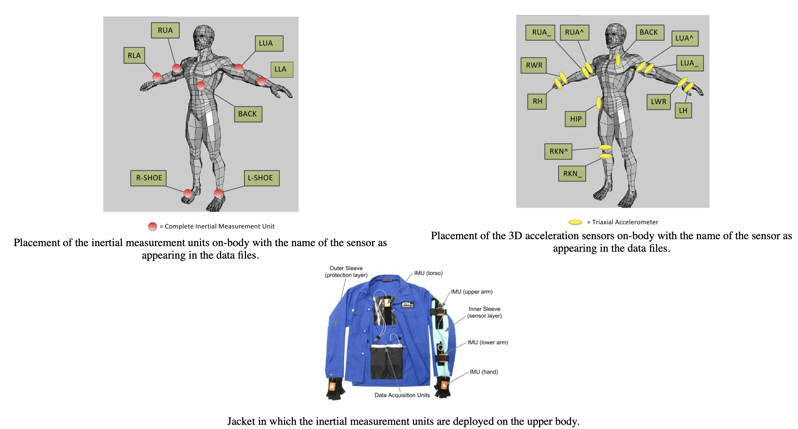

# IoMT-project
## Requirements
To make sure you have all the packages you need to run the scripts, download this folder and run:
`sh install.sh`
all the scripts will be installed with pip.

## Load data
Dataset available [here](https://archive.ics.uci.edu/ml/datasets/OPPORTUNITY+Activity+Recognition), detailed description [here](file:///Users/nicolez/Documents/GitHub/IoMT-project/OpportunityUCIDataset/doc/documentation.html).

Sensors are located as shown in the figure below.

  

In particular, dfHelper contains useful functions to load data and collect into an organized df:
- load_data_adl: load data from ADL dataset given a subject and a run;
- get_HL_activity_data: return the dataframe of data corresponding to the HL activities for a given dataframe;
- get_locomotion_data: return the dataframe of data corresponding to the locomotion activities for a given dataframe;
- get_signals: return the dataframe of data corresponding to the signals for a given dataframe;
- get_sensor_data: returns a dataframe with only gyroscope, accelerometer and magnetometer data. For each signal we get the modulus of the three different components as done in Hanzika's thesis.

## Clustering
