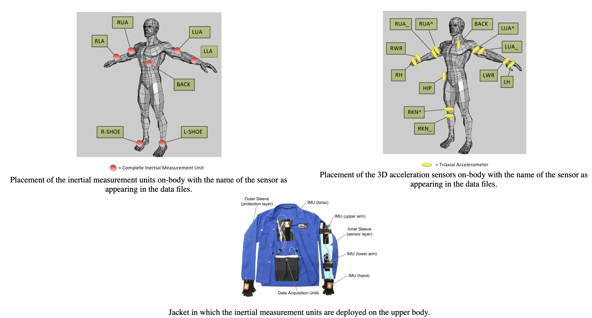
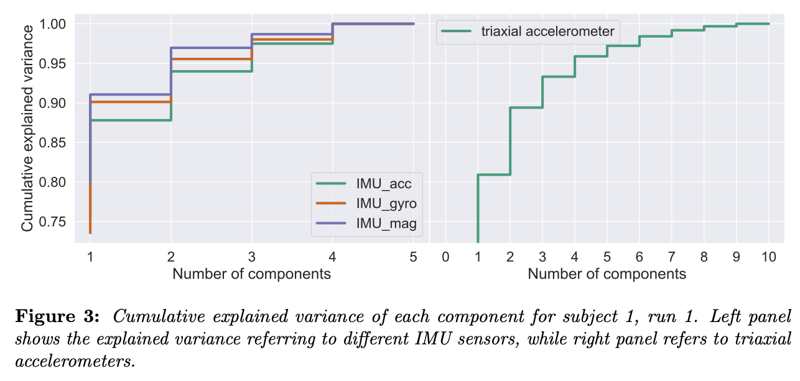
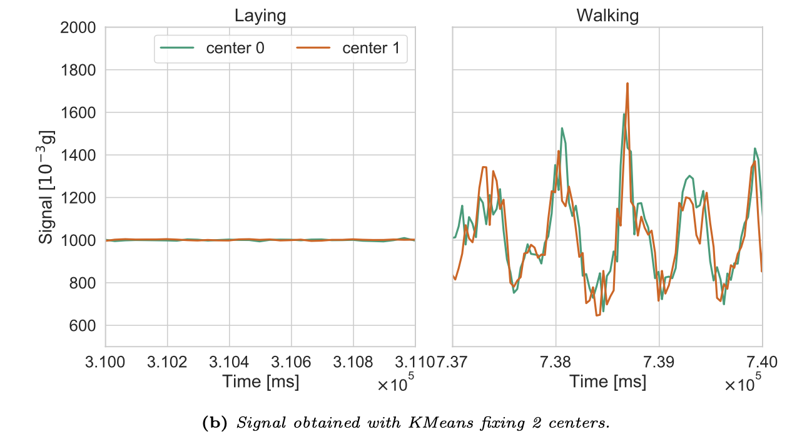
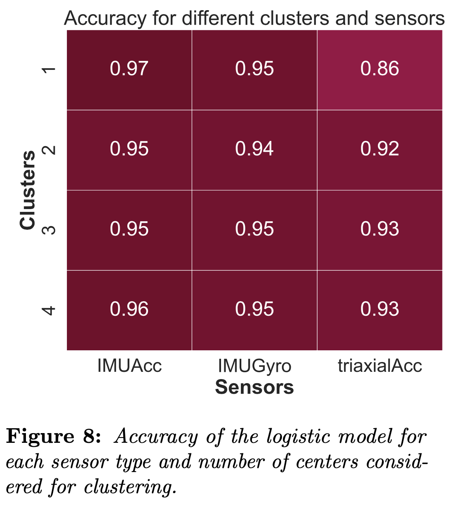

# IoMT-project

The Internet of Medical Things (IoMT) is playing a central role in the healthcare industry to improve the living conditions of individuals through suitable technological solutions. Clearly, such advanced systems work by processing complex data continuously produced across a variety of different scenarios, such as physical and environmental signals.
Nevertheless, data coming from all of these sensors can easily saturate the capacity of com- munication networks, which makes it necessary to design a proper transmission process capable of preserving the reliability of the network at cost of the lower possible leak of information.

## Requirements
To make sure you have all the packages you need to run the scripts, download this folder and run:
`sh install.sh`
all the scripts will be installed with pip.

## Load data
Dataset available [here](https://archive.ics.uci.edu/ml/datasets/OPPORTUNITY+Activity+Recognition).

Sensors are located as shown in the figure below.

  

In particular, dfHelper contains useful functions to load data and collect into an organized df:
- load_data_adl: load data from ADL dataset given a subject and a run;
- get_HL_activity_data: return the dataframe of data corresponding to the HL activities for a given dataframe;
- get_locomotion_data: return the dataframe of data corresponding to the locomotion activities for a given dataframe;
- get_signals: return the dataframe of data corresponding to the signals for a given dataframe;
- get_sensor_data: returns a dataframe with only gyroscope, accelerometer and magnetometer data. For each signal we get the modulus of the three different components as done in Hanzika's thesis.

## Principal components analysis
For each of the sensor type, we perform a PCA and we compute the explained variance. Such quantity gives indeed an estimation of how much variance of the original dataset is encoded in each component, thus, indirectly, it refers to the amount of correlation of the original features. 

A possible result follows:

  

From a physical point of view such observations suggest that there is high correlation among same sensor data, thus that it is possible to consider only a few sensors for each type. 

## Clustering and validation

1. **Clustering**: we consider data referring to two locomotion activities, walking and laying, and for each millisecond we apply KMeans clustering with 1 to 4 centers, example of the results:

    

      
    

  
2. **Binary classification**: we try to give an answer to the following question: how well can we still distinguish high level activity after clustering? The approach is straightforward: we train a binary classifier, binary for sake of simplicity, on part of the original features and validate its performances on a test subset. Finally, we test the accuracy of our model on the data obtained from the signals of the centroids obtained through KMeans. Two approaches are exploited:

      - **Logistic Regression**: we build a dataset of amplitudes labeled with the corresponding locomotion activity, walking or laying, train a logistic regression test in on the cluster data, accuracy scores follow:
        

          
        

      - **Neural Model**: binary classifier of time-series by means of TSAI with InceptionTime architecture.

